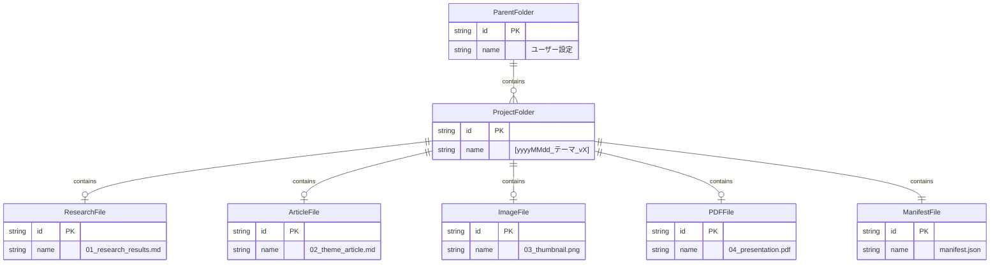

# 設計書

## ドキュメント情報

| 項目 | 内容 |
|------|------|
| プロジェクト名 | ArticleCreator |
| バージョン | 1.2.0 |
| 最終更新日 | 2026-01-05 |
| ステータス | Released |
| 対応要件定義書 | requirements.md v1.2.0 |

## 目次

1. [アーキテクチャ概要](#アーキテクチャ概要)
2. [コンポーネント設計](#コンポーネント設計)
3. [データ設計](#データ設計)
4. [インターフェース設計](#インターフェース設計)
5. [技術的決定事項](#技術的決定事項)
6. [情報の明確性チェック](#情報の明確性チェック)

---

## アーキテクチャ概要

### システム構成図


### 技術スタック

| レイヤー | 技術 | バージョン |
|----------|------|-----------|
| フロントエンド | HTML + Material Design Lite | MDL 1.3.0 |
| バックエンド | Google Apps Script | V8 Runtime |
| データストレージ | PropertiesService | - |
| ファイルストレージ | Google Drive API | v3 |

### データフロー図


---

## コンポーネント設計

### UIコンポーネント（HTML/CSS/JS）

**目的:** ユーザーインターフェースの提供

**責務:**
- タブナビゲーションの制御（NFR-009に対応）
- フォーム入力の管理
- google.script.run を介したバックエンドとの通信
- クリップボードへのコピー機能（REQ-003）
- 外部URL（Gem）を新しいタブで開く機能（REQ-003）
- ファイルアップロード機能（REQ-013, REQ-015）
- トースト通知表示（NFR-008）

**構造:**
```
サイドバー
├── ヘッダー（タイトル + 設定ボタン）
├── タブナビゲーション（MDLタブ）
│   ├── 調査タブ（Phase 1）
│   ├── 執筆タブ（Phase 1）
│   ├── 画像タブ（Phase 3）
│   ├── 資料タブ（Phase 3）
│   └── 完了タブ（Phase 2-3）
├── コンテンツエリア
│   └── 各タブのフォーム/コンテンツ
├── 設定モーダル（REQ-007, REQ-008）
└── トースト通知エリア
```

#### タブ別UI仕様

##### 調査タブ（REQ-001, REQ-002, REQ-003）

| 要素 | タイプ | 説明 |
|------|--------|------|
| テーマ入力 | mdl-textfield | 記事テーマの入力（オートセーブ対応） |
| プロンプト表示 | div.prompt-area | 生成された調査プロンプトを表示 |
| コピーボタン | mdl-button | プロンプトをクリップボードにコピー |
| Gem開くボタン | mdl-button--primary | Gem A（Research）を別タブで開く |
| 調査結果入力 | mdl-textfield--textarea | Gemからの調査結果をペースト |

##### 執筆タブ（REQ-004, REQ-005, REQ-006, REQ-003）

| 要素 | タイプ | 説明 |
|------|--------|------|
| ターゲット選択 | select | エンジニア/デザイナー/PM/非技術者 |
| トーン選択 | select | 9種類のトーン |
| プロンプト表示 | div.prompt-area | 生成された執筆プロンプト |
| コピーボタン | mdl-button | プロンプトをクリップボードにコピー |
| Gem開くボタン | mdl-button--primary | Gem B（Writing）を別タブで開く |
| 記事入力 | mdl-textfield--textarea | Gemからの記事をペースト |

##### 画像タブ（REQ-012, REQ-013, REQ-003）

| 要素 | タイプ | 説明 |
|------|--------|------|
| プロンプト表示 | div.prompt-area | 生成された画像プロンプト（日本語） |
| コピーボタン | mdl-button | プロンプトをクリップボードにコピー |
| Gem開くボタン | mdl-button--primary | Gem C（Nanobanana）を別タブで開く |
| ファイル選択 | input[type=file] | accept="image/*" |
| プレビュー | img | 選択した画像のプレビュー表示 |

##### 資料タブ（REQ-014, REQ-015, REQ-003）

| 要素 | タイプ | 説明 |
|------|--------|------|
| プロンプト表示 | div.prompt-area | スライド構成プロンプト |
| コピーボタン | mdl-button | プロンプトをクリップボードにコピー |
| Gem開くボタン | mdl-button--primary | Gem D（Slides）を別タブで開く |
| NotebookLM手順 | div.instructions | 連携手順の表示 |
| ファイル選択 | input[type=file] | accept="application/pdf" |

##### 完了タブ（REQ-016, REQ-017, REQ-018, REQ-019）

| 要素 | タイプ | 説明 |
|------|--------|------|
| 成果物一覧 | ul.checklist | 各ファイルの保存状況をチェック表示 |
| 警告表示 | div.warning | 必須ファイル不足時の警告 |
| 全て保存ボタン | mdl-button--primary | 一括保存を実行 |
| フォルダリンク | a | 保存後にフォルダURLを表示 |
| 新規作成ボタン | mdl-button--accent | 確認後に状態をリセット |

#### 設定モーダル（REQ-007, REQ-008）

| 要素 | タイプ | 説明 |
|------|--------|------|
| Gem A URL | mdl-textfield | Research用GemのURL |
| Gem B URL | mdl-textfield | Writing用GemのURL |
| Gem C URL | mdl-textfield | Nanobanana用GemのURL |
| Gem D URL | mdl-textfield | Slides用GemのURL |
| フォルダID | mdl-textfield | 保存先親フォルダID |
| 保存ボタン | mdl-button--primary | 設定を保存 |

### バックエンドコンポーネント（Code.gs）

**目的:** ビジネスロジックの実行とデータ管理

**責務:**

- プロンプトテンプレートの管理と生成
- PropertiesService を介した状態管理（NFR-004, NFR-005）
- Google Drive API を介したファイル操作
- manifest.json の生成
- バリデーション処理（REQ-017）

**主要関数:**

| 関数名 | 責務 | 関連要件 |
|--------|------|----------|
| `onOpen()` | メニュー追加・サイドバー起動 | - |
| `showSidebar()` | サイドバーHTMLの提供 | NFR-007, NFR-009 |
| `saveSettings(settings)` | 設定の保存 | REQ-007, REQ-008 |
| `getSettings()` | 設定の取得 | REQ-007, REQ-008 |
| `saveState(state)` | 作業状態の保存（オートセーブ） | REQ-011, NFR-006 |
| `getState()` | 作業状態の取得 | REQ-011 |
| `clearState()` | 作業状態のクリア | REQ-019 |
| `generateResearchPrompt(theme)` | 調査プロンプト生成 | REQ-002 |
| `generateWritingPrompt(params)` | 執筆プロンプト生成（調査有無で分岐） | REQ-006 |
| `generateImagePrompt(params)` | 画像プロンプト生成（日本語） | REQ-012 |
| `generateSlidesPrompt(params)` | スライド構成プロンプト生成 | REQ-014 |
| `validateBeforeSave()` | 保存前バリデーション | REQ-017 |
| `createProjectFolder(theme)` | プロジェクトフォルダ自動生成 | REQ-009 |
| `getNextVersion(theme)` | バージョン番号取得 | REQ-009 |
| `saveAllToDrive(data)` | 全成果物の一括保存 | REQ-010, REQ-016 |
| `generateManifest(data)` | manifest.json生成 | REQ-018 |
| `uploadImage(base64Data)` | 画像データの一時保持 | REQ-013 |
| `uploadPdf(base64Data)` | PDFデータの一時保持 | REQ-015 |

#### 関数詳細仕様

##### generateWritingPrompt(params)

```javascript
/**
 * 執筆プロンプトを生成する
 * @param {Object} params
 * @param {string} params.theme - テーマ
 * @param {string} params.target - ターゲット読者
 * @param {string} params.tone - トーン
 * @param {string} params.researchResult - 調査結果（空文字可）
 * @returns {Object} { prompt: string, mode: 'factBased' | 'aiKnowledge' }
 */
```

**処理ロジック:**
- `researchResult` が空文字または未定義の場合: 「AI知識補完」モード
- `researchResult` が存在する場合: 「事実準拠」モード

##### createProjectFolder(theme)

```javascript
/**
 * プロジェクトフォルダを作成する
 * @param {string} theme - テーマ名
 * @returns {Object} { folderId: string, folderName: string, folderUrl: string }
 */
```

**処理ロジック:**
1. 保存先親フォルダIDを設定から取得
2. 同一テーマの既存フォルダをチェック
3. バージョン番号を決定（_v1, _v2, ...）
4. フォルダ名: `yyyyMMdd_${theme}_v${version}`
5. フォルダを作成して情報を返却

##### validateBeforeSave()

```javascript
/**
 * 保存前のバリデーションを実行する
 * @returns {Object} { valid: boolean, errors: string[] }
 */
```

**バリデーションルール:**
- 保存先フォルダIDが設定されていること（MISSING_FOLDER_ID）
- 記事コンテンツが存在すること（MISSING_REQUIRED_FILES）

---

## データ設計

### PropertiesService データ構造

#### 設定データ（UserProperties）

| キー | 型 | 説明 |
|------|-----|------|
| `gemUrl_research` | string | Gem A（調査用）のURL |
| `gemUrl_writing` | string | Gem B（執筆用）のURL |
| `gemUrl_nanobanana` | string | Gem C（画像用）のURL |
| `gemUrl_slides` | string | Gem D（スライド用）のURL |
| `driveFolderId` | string | 保存先親フォルダID |

#### 作業状態データ（UserProperties）

| キー | 型 | 説明 | 関連要件 |
|------|-----|------|----------|
| `state_theme` | string | 入力されたテーマ | REQ-001 |
| `state_target` | string | 選択されたターゲット | REQ-004 |
| `state_tone` | string | 選択されたトーン | REQ-005 |
| `state_researchResult` | string | 調査結果テキスト | REQ-002 |
| `state_articleContent` | string | 記事コンテンツ（Markdown） | REQ-006 |
| `state_researchPrompt` | string | 使用した調査プロンプト | REQ-018 |
| `state_writingPrompt` | string | 使用した執筆プロンプト | REQ-018 |
| `state_imagePrompt` | string | 使用した画像プロンプト | REQ-012, REQ-018 |
| `state_slidesPrompt` | string | 使用したスライドプロンプト | REQ-014, REQ-018 |
| `state_imageBase64` | string | アップロードされた画像（Base64） | REQ-013 |
| `state_pdfBase64` | string | アップロードされたPDF（Base64） | REQ-015 |

**注意:** Base64データはサイズが大きくなる可能性があるため、PropertiesServiceの制限（9KB/プロパティ）を超える場合は一時的にDriveに保存する方式に切り替える。

### Google Drive ファイル構造



### manifest.json スキーマ

```json
{
  "version": "1.0",
  "createdAt": "2026-01-04T12:00:00Z",
  "theme": "テーマ名",
  "target": "エンジニア",
  "tone": "技術的",
  "hasResearch": true,
  "files": {
    "research": "01_research_results.md",
    "article": "02_theme_article.md",
    "image": "03_thumbnail.png",
    "pdf": "04_presentation.pdf"
  },
  "prompts": {
    "research": "使用した調査プロンプト",
    "writing": "使用した執筆プロンプト",
    "image": "使用した画像プロンプト"
  }
}
```

---

## インターフェース設計

### フロントエンド - バックエンド通信

全ての通信は `google.script.run` を使用し、コールバックで結果を受け取る。

```javascript
google.script.run
  .withSuccessHandler(onSuccess)
  .withFailureHandler(onError)
  .functionName(params);
```

#### saveSettings(settings) - REQ-007, REQ-008

| 項目 | 内容 |
|------|------|
| 呼び出し元 | 設定モーダル「保存」ボタン |
| 認証 | 必要（Google認証済み） |

**リクエスト:**

```javascript
{
  "gemUrl_research": "https://...",
  "gemUrl_writing": "https://...",
  "gemUrl_nanobanana": "https://...",
  "gemUrl_slides": "https://...",
  "driveFolderId": "1ABC..."
}
```

**レスポンス:**

```javascript
{
  "success": true,
  "message": "設定を保存しました"
}
```

#### getSettings() - REQ-007, REQ-008

| 項目 | 内容 |
|------|------|
| 呼び出し元 | サイドバー初期化時、設定モーダル表示時 |
| 認証 | 必要 |

**リクエスト:** なし

**レスポンス:**

```javascript
{
  "gemUrl_research": "https://...",
  "gemUrl_writing": "https://...",
  "gemUrl_nanobanana": "https://...",
  "gemUrl_slides": "https://...",
  "driveFolderId": "1ABC..."
}
```

#### saveState(state) - REQ-011, NFR-006

| 項目 | 内容 |
|------|------|
| 呼び出し元 | 各入力フィールドの変更時（デバウンス500ms後） |
| 認証 | 必要 |

**リクエスト:**

```javascript
{
  "theme": "テーマ名",
  "target": "エンジニア",
  "tone": "技術的",
  "researchResult": "調査結果...",
  "articleContent": "記事内容...",
  "researchPrompt": "生成されたプロンプト...",
  "writingPrompt": "生成されたプロンプト...",
  "imagePrompt": "生成されたプロンプト...",
  "slidesPrompt": "生成されたプロンプト...",
  "imageBase64": "data:image/png;base64,...",
  "pdfBase64": "data:application/pdf;base64,..."
}
```

**レスポンス:**

```javascript
{
  "success": true
}
```

#### getState() - REQ-011

| 項目 | 内容 |
|------|------|
| 呼び出し元 | サイドバー初期化時 |
| 認証 | 必要 |

**リクエスト:** なし

**レスポンス:** saveState のリクエストと同じ構造

#### clearState() - REQ-019

| 項目 | 内容 |
|------|------|
| 呼び出し元 | 完了タブ「新規作成」ボタン（確認後） |
| 認証 | 必要 |

**リクエスト:** なし

**レスポンス:**

```javascript
{
  "success": true,
  "message": "作業状態をクリアしました"
}
```

#### generateResearchPrompt(theme) - REQ-002

| 項目 | 内容 |
|------|------|
| 呼び出し元 | 調査タブ テーマ入力時 |
| 認証 | 必要 |

**リクエスト:**

```javascript
"Gemini 2.0 Flash"
```

**レスポンス:**

```javascript
{
  "prompt": "「Gemini 2.0 Flash」について、2026年現在の最新状況を調査してください。技術的背景、最新アップデート、競合比較、実装の注意点を日本語の箇条書きで抽出してください。",
  "gemUrl": "https://gemini.google.com/..."
}
```

#### generateWritingPrompt(params) - REQ-006

| 項目 | 内容 |
|------|------|
| 呼び出し元 | 執筆タブ表示時、ターゲット/トーン変更時 |
| 認証 | 必要 |

**リクエスト:**

```javascript
{
  "theme": "Gemini 2.0 Flash",
  "target": "エンジニア",
  "tone": "技術的",
  "researchResult": "調査結果テキスト..."
}
```

**レスポンス:**

```javascript
{
  "prompt": "提供した調査結果に基づき、エンジニア向けに技術的で執筆してください。Markdown形式で出力してください。",
  "mode": "factBased",
  "gemUrl": "https://gemini.google.com/..."
}
```

#### generateImagePrompt(params) - REQ-012

| 項目 | 内容 |
|------|------|
| 呼び出し元 | 画像タブ表示時 |
| 認証 | 必要 |

**リクエスト:**

```javascript
{
  "articleContent": "記事内容...",
  "tone": "技術的"
}
```

**レスポンス:**

```javascript
{
  "prompt": "以下の記事内容を象徴するアイキャッチ用の日本語プロンプトを作成してください。スタイル：技術的、比率：16:9",
  "gemUrl": "https://gemini.google.com/..."
}
```

#### generateSlidesPrompt(params) - REQ-014

| 項目 | 内容 |
|------|------|
| 呼び出し元 | 資料タブ表示時 |
| 認証 | 必要 |

**リクエスト:**

```javascript
{
  "theme": "テーマ名",
  "articleContent": "記事内容..."
}
```

**レスポンス:**

```javascript
{
  "prompt": "以下の記事内容に基づいて、スライド構成案を作成してください...",
  "gemUrl": "https://gemini.google.com/..."
}
```

#### validateBeforeSave() - REQ-017

| 項目 | 内容 |
|------|------|
| 呼び出し元 | 完了タブ表示時、「全て保存」ボタンクリック時 |
| 認証 | 必要 |

**リクエスト:** なし

**レスポンス:**

```javascript
{
  "valid": true,
  "errors": [],
  "warnings": ["画像がアップロードされていません", "PDFがアップロードされていません"],
  "files": {
    "research": true,
    "article": true,
    "image": false,
    "pdf": false
  }
}
```

#### saveAllToDrive(data) - REQ-009, REQ-010, REQ-016, REQ-018

| 項目 | 内容 |
|------|------|
| 呼び出し元 | 完了タブ「全て保存」ボタン |
| 認証 | 必要 |

**リクエスト:**

```javascript
{
  "theme": "テーマ名",
  "target": "エンジニア",
  "tone": "技術的",
  "researchResult": "調査結果テキスト...",
  "articleContent": "# 記事タイトル\n...",
  "imageBase64": "data:image/png;base64,...",
  "pdfBase64": "data:application/pdf;base64,...",
  "prompts": {
    "research": "使用した調査プロンプト",
    "writing": "使用した執筆プロンプト",
    "image": "使用した画像プロンプト"
  }
}
```

**レスポンス:**

```javascript
{
  "success": true,
  "folderId": "1XYZ...",
  "folderName": "20260104_テーマ名_v1",
  "folderUrl": "https://drive.google.com/drive/folders/...",
  "files": {
    "research": "01_research_results.md",
    "article": "02_theme_article.md",
    "image": "03_thumbnail.png",
    "pdf": "04_presentation.pdf",
    "manifest": "manifest.json"
  }
}
```

**エラーレスポンス:**

| コード | 説明 | 関連要件 |
|--------|------|----------|
| MISSING_FOLDER_ID | 保存先フォルダIDが設定されていない | REQ-017 |
| MISSING_REQUIRED_FILES | 必須ファイル（記事）が不足 | REQ-017 |
| DRIVE_API_ERROR | Drive APIエラー | - |
| QUOTA_EXCEEDED | GAS実行時間制限超過 | - |

---

## 技術的決定事項

### ADR-001: 単一ファイル構成の採用

**ステータス:** Accepted

**関連要件:** NFR-010

**コンテキスト:**
GASプロジェクトの構成方法として、複数ファイルに分割する方法と単一ファイルにまとめる方法がある。

**決定:**
Code.gs の単一ファイル構成を採用する。HTML/CSS/JSはHtmlServiceのcreateHtmlOutputを使用してインライン化する。

**選択肢:**

| 選択肢 | メリット | デメリット |
|--------|---------|----------|
| 単一ファイル | デプロイ・管理がシンプル、依存関係の問題なし | ファイルが長くなる |
| 複数ファイル | 関心の分離が明確 | GASの読み込み順序管理が必要 |

**根拠:**
プロジェクト規模が中程度であり、単一ファイルでも管理可能。デプロイの簡便性を優先。要件NFR-010の制約に対応。

### ADR-002: Material Design Lite の採用

**ステータス:** Accepted

**関連要件:** NFR-007

**コンテキスト:**
サイドバーUIのデザインフレームワークを選定する必要がある。

**決定:**
Google Material Design Lite (MDL) バージョン1.3.0を採用する。CDN経由で読み込む。

**選択肢:**

| 選択肢 | メリット | デメリット |
|--------|---------|----------|
| Material Design Lite | Googleサービスとの親和性、軽量 | 開発終了（メンテナンスモード） |
| Materialize CSS | アクティブに開発中 | ファイルサイズが大きい |
| Bootstrap | 広く普及、情報豊富 | Google UIとの親和性低い |

**根拠:**
Google Workspace アドオンとしての一貫性を重視。MDLは軽量でサイドバーに適している。

### ADR-003: PropertiesService による状態管理

**ステータス:** Accepted

**関連要件:** NFR-004, NFR-005, REQ-011

**コンテキスト:**
ユーザーの作業状態と設定を永続化する方法を決定する必要がある。

**決定:**
PropertiesService（UserProperties）を使用する。ユーザーごとにデータを分離し、セキュリティを確保する。

**選択肢:**

| 選択肢 | メリット | デメリット |
|--------|---------|----------|
| PropertiesService | GAS標準、追加設定不要、ユーザー分離 | 容量制限あり（500KB） |
| スプレッドシート | 容量大、履歴管理可能 | 追加のファイル管理必要 |
| ローカルストレージ | 高速 | ブラウザ依存、GASから直接アクセス不可 |

**根拠:**
設定と作業状態の合計容量は500KB以内に収まる見込み。追加のインフラなしで実装可能。NFR-004のデータ分離要件を満たす。

### ADR-004: Base64形式でのファイル一時保持

**ステータス:** Accepted

**関連要件:** REQ-013, REQ-015

**コンテキスト:**
画像とPDFをアップロード後、一括保存まで保持する方法を決定する必要がある。

**決定:**
Base64エンコードしてPropertiesServiceに一時保存する。ただし、9KBを超える場合はDriveに一時ファイルとして保存し、そのIDを保持する。

**選択肢:**

| 選択肢 | メリット | デメリット |
|--------|---------|----------|
| Base64 + Properties | シンプル、追加リソース不要 | 9KB/プロパティの制限 |
| Drive一時ファイル | 容量制限なし | 一時ファイル管理が必要 |
| Blob直接保持 | 変換不要 | GAS実行間で保持不可 |

**根拠:**
画像・PDFのサイズに応じてハイブリッド方式を採用。小さいファイルはPropertiesで、大きいファイルはDriveで対応。

### ADR-005: デバウンスによるオートセーブ

**ステータス:** Accepted

**関連要件:** NFR-006

**コンテキスト:**
入力内容のオートセーブの頻度とタイミングを決定する必要がある。

**決定:**
入力停止後500msのデバウンスでオートセーブを実行する。

**選択肢:**

| 選択肢 | メリット | デメリット |
|--------|---------|----------|
| デバウンス500ms | API呼び出し回数削減、UX良好 | 即座に保存されない |
| 即時保存 | データ損失リスク最小 | API制限に抵触する可能性 |
| 定期保存（5秒毎） | 安定したAPI呼び出し | 最大5秒のデータ損失リスク |

**根拠:**
NFR-006の要件「500ミリ秒のデバウンス後」に対応。入力体験を阻害せず、適切なタイミングで保存。

---

## 情報の明確性チェック

### 明示された情報

| カテゴリ | 項目 | 値 | 確認状況 |
|----------|------|-----|----------|
| 技術 | ファイル構成 | 単一ファイル（Code.gs） | 確認済み |
| 技術 | UIフレームワーク | Material Design Lite 1.3.0 | 確認済み |
| 機能 | Gem連携 | コピーボタン + URL開くボタンの両方 | 確認済み |
| 機能 | 対象範囲 | Phase 1-3 すべて | 確認済み |
| UI | ターゲット選択肢 | エンジニア・デザイナー・PM・非技術者（4種類） | 確認済み |
| UI | トーン選択肢 | カジュアル・フォーマル・技術的・教育的・実践的・解説的・フレンドリー・ビジネスライク・アカデミック（9種類） | 確認済み |
| データ | フォルダ命名規則 | yyyyMMdd_テーマ名_vX | 確認済み |
| データ | ファイル命名規則 | 01_research_results.md, 02_theme_article.md, 03_thumbnail.png, 04_presentation.pdf, manifest.json | 確認済み |
| データ | プロンプトテンプレート | spec.mdに記載済み | 確認済み |
| 制約 | GAS実行時間制限 | 6分 | 確認済み |
| 制約 | PropertiesService制限 | 9KB/プロパティ、500KB/全体 | 確認済み |

### 不明/要確認の情報

- [x] すべての主要仕様は確認済み

### 要件-設計対応マトリクス

| 要件ID | 設計要素 | 対応状況 |
|--------|----------|----------|
| REQ-001 | 調査タブ テーマ入力UI | 対応済み |
| REQ-002 | generateResearchPrompt() | 対応済み |
| REQ-003 | コピーボタン、Gem開くボタン（全タブ共通） | 対応済み |
| REQ-004 | 執筆タブ ターゲット選択UI | 対応済み |
| REQ-005 | 執筆タブ トーン選択UI | 対応済み |
| REQ-006 | generateWritingPrompt() | 対応済み |
| REQ-007 | 設定モーダル Gem URL入力、saveSettings() | 対応済み |
| REQ-008 | 設定モーダル フォルダID入力、saveSettings() | 対応済み |
| REQ-009 | createProjectFolder(), getNextVersion() | 対応済み |
| REQ-010 | saveAllToDrive() | 対応済み |
| REQ-011 | saveState(), getState(), ADR-003 | 対応済み |
| REQ-012 | generateImagePrompt(), 画像タブUI | 対応済み |
| REQ-013 | 画像タブ ファイル選択UI、uploadImage() | 対応済み |
| REQ-014 | generateSlidesPrompt(), 資料タブUI | 対応済み |
| REQ-015 | 資料タブ ファイル選択UI、uploadPdf() | 対応済み |
| REQ-016 | saveAllToDrive(), 完了タブUI | 対応済み |
| REQ-017 | validateBeforeSave(), 完了タブ警告表示 | 対応済み |
| REQ-018 | generateManifest(), manifest.jsonスキーマ | 対応済み |
| REQ-019 | clearState(), 完了タブ新規作成ボタン | 対応済み |
| NFR-001 | 非同期処理、軽量UI設計 | 対応済み |
| NFR-002 | テンプレート置換による高速生成 | 対応済み |
| NFR-003 | GAS標準認証（Google認証） | 対応済み |
| NFR-004 | UserProperties、ADR-003 | 対応済み |
| NFR-005 | PropertiesService永続化、ADR-003 | 対応済み |
| NFR-006 | デバウンス500ms、ADR-005 | 対応済み |
| NFR-007 | Material Design Lite、ADR-002 | 対応済み |
| NFR-008 | トースト通知UI | 対応済み |
| NFR-009 | 5タブナビゲーション | 対応済み |
| NFR-010 | 単一ファイル構成、ADR-001 | 対応済み |

### 確認完了

すべての不明/要確認項目が解消されていることを確認:

- [x] 上記の不明項目はすべて確認済み
- [x] 全要件（REQ-001〜REQ-019）に対応する設計要素が存在する
- [x] 全非機能要件（NFR-001〜NFR-010）に対応する設計要素が存在する
