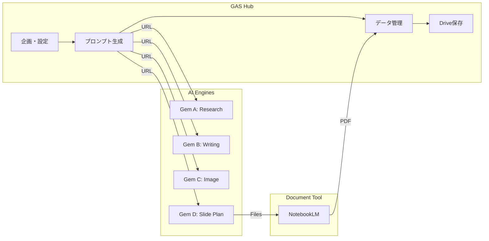

# ArticleCreator プロジェクト構成定義書 (v2.3)

## 1. プロジェクト概要

Google Apps Script (GAS) をハブとし、Gemini 3.0 Pro (Gems) の調査・生成能力と NotebookLM の資料構成能力を組み合わせた、自律型コンテンツ制作パイプライン。
思考プロセスを Gemini Gems に、管理と定型処理を GAS に分離することで、エンジニア向け高品質記事の制作リードタイムを劇的に短縮する。

---

## 2. システム構成

### 2.1 コンポーネント役割

| コンポーネント | 役割 | 備考 |
| :--- | :--- | :--- |
| **GAS ダッシュボード** | 司令塔。UI提供、プロンプト生成、進捗・履歴管理、Drive整理 | PC操作前提のサイドバー形式 |
| **Gemini Gems (Web)** | 思考・生成エンジン。Deep Research、執筆、画像、スライド構成 | 用途別に4つの専用Gem URLを管理 |
| **NotebookLM** | 資料統合。複数ソース（調査＋記事）に基づくスライドPDF生成 | Driveファイル読み込み形式 |
| **Google Drive** | 成果物の永続保存および NotebookLM 用の中間ファイル保持 | フォルダ自動整理と枝番管理 |

---

## 3. UI/UX 仕様

### 3.1 画面設計

* **上部タブナビゲーション**: ステップに沿った 5 タブ構成（調査 / 執筆 / 画像 / 資料 / 完了）。
* **状態保持 (Resume)**: `PropertiesService` を活用し、入力内容を随時オートセーブ。ブラウザを閉じても「前回の続きから再開」が可能。
* **警告ロジック**:
  * 調査スキップ時：AI知識のみで執筆する旨の確認ダイアログを表示。
  * 必須ファイル欠落時：完了タブにて、記事・画像・PDFのアップロード不足を警告し、保存をロック。

### 3.2 URLマネージャ（設定画面）

以下の設定値を `PropertiesService` に保持し、いつでも編集可能とする。

* 4つの専用 Gem URL (Research / Writing / Nanobanana / Slides)
* 保存先 Google Drive 親フォルダ ID

---

## 4. 統合ワークフロー (19 Steps)

### フェーズ A: 調査 (Research)

* **Step 1-5**: テーマ入力 → 調査プロンプト生成 → Gem A で Deep Research 実行 → 結果を GAS に保存（スキップ可能）。

### フェーズ B: 執筆 (Writing)

* **Step 6-9**: ターゲット・トーン選択 → 執筆プロンプト生成 → Gem B で記事作成 → Markdown 形式で GAS にペースト。
  * **ロジック**: 調査結果がある場合は「事実準拠」、ない場合は「AI知識補完」にプロンプトを自動切替。

### フェーズ C: 視覚化 (Visualization)

* **Step 10-13**: **Nanobanana** 用の日本語プロンプトを生成 → Gem C で画像生成 → 画像を PC に保存し GAS 上でファイル選択。

### フェーズ D: 資料化 (Slides & NotebookLM)

* **Step 14-18**: スライド構成プロンプト生成 → Gem D で構成案出力 → **NotebookLM 連携**。
  * **連携詳細**: GAS が調査結果と記事を Drive にファイルとして一時生成。NotebookLM がそれらをソースとして読み込み、PDF を生成。
  * **PDF登録**: 生成された PDF を PC から GAS 経由でアップロード。

### フェーズ E: 完了 (Finalize)

* **Step 19**: 「全てのファイルを保存」実行。Drive に `[yyyyMMdd_テーマ名_vX]` フォルダを自動作成し整理。

---

## 5. プロンプト・テンプレート詳細

### 5.1 調査用 (Gem A: DeepResearch)

DeepResearch Gem 用の YAML 形式リクエストを生成する。詳細は `docs/DeepResearch/` を参照。

```yaml
# Tech Deep Research Request (for writing)
topic: "{テーマ}"
article_goal: "技術記事として読者が導入判断・実装判断できる根拠を揃える"
audience: "{ターゲット}"
depth: "{調査深度: quick/standard/deep}"

constraints:
  time_range: "最新優先（2024-01以降）"
  versions: []
  languages: ["ja", "en"]

scope:
  include: ["技術的背景", "最新アップデート", "競合比較", "実装の注意点", "落とし穴", "ベストプラクティス"]
  exclude: ["初心者向け基礎の長い説明"]

deliverable:
  type: "research_report"
  length: "A4 2〜3枚相当"

citation:
  required: true
  style: "inline_links"

quality_bar:
  prioritize_primary_sources: true
  min_independent_sources_for_key_claims: 2
  allow_blogs_as_secondary: true

questions_to_answer:
  - "この技術の現在の位置付けと成熟度は？"
  - "導入時の主要な制約や落とし穴は？"
  - "競合・代替技術との比較ポイントは？"
  - "実運用での注意点やベストプラクティスは？"
```

### 5.2 執筆用 (Gem B)
>
> **調査あり**: 「提供した調査結果に基づき、{ターゲット}向けに{トーン}で執筆してください。Markdown形式で出力してください」。
> **調査なし**: 「{テーマ}について、あなたの知識を用いて{ターゲット}向けに{トーン}で解説記事を執筆してください」。

### 5.3 画像生成用 (Gem C: Nanobanana)
>
> 「以下の記事内容を象徴するアイキャッチ用の日本語プロンプトを作成してください。スタイル：{トーン}、比率：16:9」。

---

## 6. データ管理仕様

### 6.1 フォルダ・ファイル構造

```text
[保存先親フォルダ]
  └ [20260105_テーマ名_v1]
      ├ 01_research_results.md   (調査結果)
      ├ 02_theme_article.md      (記事本体)
      ├ 03_thumbnail.png         (画像)
      ├ 04_presentation.pdf      (スライド資料)
      └ manifest.json            (作成日時、ターゲット、使用プロンプト等のメタデータ)
```

### 6.2 バージョニング

同一テーマで保存を繰り返す場合、フォルダ名末尾に `_v2`, `_v3` と枝番を自動付与して保存する。

---

## 7. MVP (Minimum Viable Product) ロードマップ

### Phase 1: 基盤構築 ✅ 完了

* 5タブ構成（調査・執筆・画像・資料・完了）のサイドバーUI。
* PropertiesService を利用した URL・フォルダ ID 管理。
* テーマ入力からの基本プロンプト生成ロジック。

### Phase 2: データ保存・整理 ✅ 完了

* Drive フォルダ自動生成、Markdown/テキストファイル出力機能。
* 履歴保存（レジュメ）機能の実装。

### Phase 3: メディア連携 ✅ 完了

* Nanobanana 画像および NotebookLM PDF のアップロード/整理機能。
* manifest.json 生成機能。

---

## 8. フロー図 (Mermaid)


