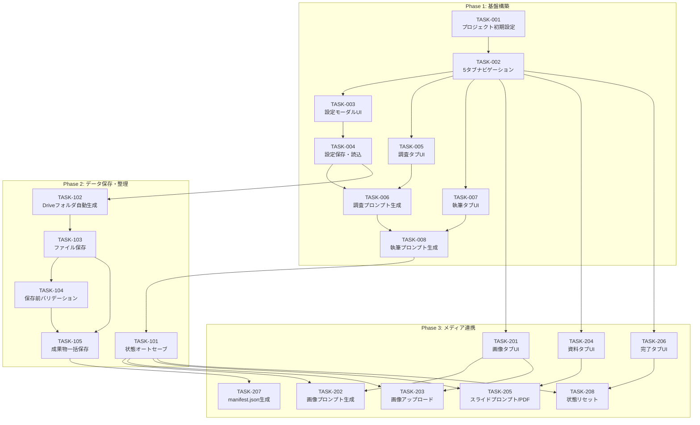

# タスク管理書

## ドキュメント情報

| 項目 | 内容 |
|------|------|
| プロジェクト名 | ArticleCreator |
| バージョン | 1.2.0 |
| 最終更新日 | 2026-01-05 |
| 対応要件定義書 | requirements.md v1.2.0 |
| 対応設計書 | design.md v1.2.0 |

## 目次

1. [進捗サマリー](#進捗サマリー)
2. [Phase 1: 基盤構築](#phase-1-基盤構築)
3. [Phase 2: データ保存・整理](#phase-2-データ保存整理)
4. [Phase 3: メディア連携](#phase-3-メディア連携)

---

## 進捗サマリー

| フェーズ | 完了 | 進行中 | 未着手 | ブロック |
|---------|------|--------|--------|----------|
| Phase 1 | 8 | 0 | 0 | 0 |
| Phase 2 | 5 | 0 | 0 | 0 |
| Phase 3 | 7 | 0 | 0 | 0 |
| **合計** | **20** | **0** | **0** | **0** |

---

## Phase 1: 基盤構築

### TASK-001: プロジェクト初期設定とHTML骨格作成

| 項目 | 内容 |
|------|------|
| ステータス | DONE |
| 見積もり | 30分 |
| 担当 | - |
| 依存 | なし |
| 関連要件 | NFR-010（単一ファイル構成）, NFR-007（MDL準拠） |

**説明:**
Code.gsファイルに基本構造を作成し、サイドバー表示のためのonOpen()、showSidebar()関数とHTMLテンプレートの骨格を実装する。

**受入基準:**
- [x] Code.gsに`onOpen()`関数が実装されている（メニューにサイドバー起動項目追加）
- [x] Code.gsに`showSidebar()`関数が実装されている
- [x] HtmlService.createHtmlOutput()でサイドバーHTMLが生成される
- [x] Material Design Lite 1.3.0のCDNがインクルードされている
- [x] 基本的なHTML構造（header, main, footer）が定義されている

**実装詳細:**
- ファイル: `/Code.gs`
- 関数:
  - `onOpen()`: メニューに「ArticleCreator」>「サイドバーを開く」を追加
  - `showSidebar()`: `HtmlService.createHtmlOutput(html).setTitle('ArticleCreator')`でサイドバー表示
- HTML構造:
  ```html
  <!DOCTYPE html>
  <html>
  <head>
    <link rel="stylesheet" href="https://code.getmdl.io/1.3.0/material.indigo-pink.min.css">
    <script defer src="https://code.getmdl.io/1.3.0/material.min.js"></script>
  </head>
  <body>
    <div class="mdl-layout">
      <!-- ヘッダー、タブ、コンテンツ領域 -->
    </div>
  </body>
  </html>
  ```

**情報の明確性:**
- [x] 明示された情報: 単一ファイル構成、Material Design Lite 1.3.0使用
- [x] 推測に基づく情報: なし

---

### TASK-002: 5タブナビゲーションUI実装

| 項目 | 内容 |
|------|------|
| ステータス | DONE |
| 見積もり | 40分 |
| 担当 | - |
| 依存 | TASK-001 |
| 関連要件 | NFR-009（5タブ構成） |

**説明:**
MDLのタブコンポーネントを使用して、5タブ構成（調査・執筆・画像・資料・完了）のナビゲーションを実装する。

**受入基準:**
- [x] 5つのタブ（調査・執筆・画像・資料・完了）が表示される
- [x] タブクリックで対応するコンテンツが切り替わる
- [x] アクティブタブが視覚的に区別される
- [x] タブ切り替えがスムーズに動作する
- [x] 設定ボタン（歯車アイコン）がヘッダーに配置される

**実装詳細:**
- ファイル: `/Code.gs`（HTMLテンプレート部分）
- HTML構造:
  ```html
  <div class="mdl-layout__header">
    <div class="mdl-layout__header-row">
      <span class="mdl-layout-title">ArticleCreator</span>
      <button id="settings-btn" class="mdl-button mdl-js-button mdl-button--icon">
        <i class="material-icons">settings</i>
      </button>
    </div>
    <div class="mdl-layout__tab-bar">
      <a href="#tab-research" class="mdl-layout__tab is-active">調査</a>
      <a href="#tab-writing" class="mdl-layout__tab">執筆</a>
      <a href="#tab-image" class="mdl-layout__tab">画像</a>
      <a href="#tab-slides" class="mdl-layout__tab">資料</a>
      <a href="#tab-complete" class="mdl-layout__tab">完了</a>
    </div>
  </div>
  ```

**情報の明確性:**
- [x] 明示された情報: 5タブ構成（調査/執筆/画像/資料/完了）
- [x] 推測に基づく情報: なし

---

### TASK-003: 設定モーダルUI実装

| 項目 | 内容 |
|------|------|
| ステータス | DONE |
| 見積もり | 30分 |
| 担当 | - |
| 依存 | TASK-002 |
| 関連要件 | REQ-007（URL設定）, REQ-008（フォルダID設定） |

**説明:**
設定モーダルのUIを実装する。4つのGem URL入力フィールドと保存先フォルダID入力フィールド、保存ボタンを配置する。

**受入基準:**
- [x] Gem A（Research）URL入力フィールドが表示される
- [x] Gem B（Writing）URL入力フィールドが表示される
- [x] Gem C（Nanobanana）URL入力フィールドが表示される
- [x] Gem D（Slides）URL入力フィールドが表示される
- [x] 保存先フォルダID入力フィールドが表示される
- [x] 「保存」ボタンが表示される
- [x] モーダルが開閉可能である
- [x] MDLのテキストフィールドスタイルが適用されている

**実装詳細:**
- ファイル: `/Code.gs`（HTMLテンプレート部分）
- HTML構造:
  ```html
  <dialog id="settings-modal" class="mdl-dialog">
    <h4 class="mdl-dialog__title">設定</h4>
    <div class="mdl-dialog__content">
      <div class="mdl-textfield mdl-js-textfield">
        <input class="mdl-textfield__input" type="text" id="gem-research-url">
        <label class="mdl-textfield__label" for="gem-research-url">Gem A (Research) URL</label>
      </div>
      <!-- 他のフィールド省略 -->
    </div>
    <div class="mdl-dialog__actions">
      <button type="button" class="mdl-button mdl-button--primary" id="save-settings-btn">保存</button>
      <button type="button" class="mdl-button close" id="close-settings-btn">閉じる</button>
    </div>
  </dialog>
  ```
- JavaScript:
  - `document.getElementById('settings-btn').onclick`: モーダルを表示
  - `dialogPolyfill.registerDialog(dialog)`: ブラウザ互換性対応

**情報の明確性:**
- [x] 明示された情報: 4つのGem URL、保存先フォルダID
- [x] 推測に基づく情報: なし

---

### TASK-004: 設定保存・読込機能実装

| 項目 | 内容 |
|------|------|
| ステータス | DONE |
| 見積もり | 30分 |
| 担当 | - |
| 依存 | TASK-003 |
| 関連要件 | REQ-007, REQ-008, NFR-004（データ分離）, NFR-005（永続化） |

**説明:**
設定値をPropertiesService（UserProperties）に保存・読込する関数を実装し、UIと連携する。

**受入基準:**
- [x] `saveSettings(settings)`関数が実装されている
- [x] `getSettings()`関数が実装されている
- [x] 保存ボタンクリックで設定が永続化される
- [x] 画面読込時に保存済み設定が復元される
- [x] 保存成功時にトースト通知が表示される（NFR-008）

**実装詳細:**
- ファイル: `/Code.gs`
- 関数:
  ```javascript
  function saveSettings(settings) {
    const userProps = PropertiesService.getUserProperties();
    userProps.setProperty('gemUrl_research', settings.gemUrl_research || '');
    userProps.setProperty('gemUrl_writing', settings.gemUrl_writing || '');
    userProps.setProperty('gemUrl_nanobanana', settings.gemUrl_nanobanana || '');
    userProps.setProperty('gemUrl_slides', settings.gemUrl_slides || '');
    userProps.setProperty('driveFolderId', settings.driveFolderId || '');
    return { success: true, message: '設定を保存しました' };
  }

  function getSettings() {
    const userProps = PropertiesService.getUserProperties();
    return {
      gemUrl_research: userProps.getProperty('gemUrl_research') || '',
      gemUrl_writing: userProps.getProperty('gemUrl_writing') || '',
      gemUrl_nanobanana: userProps.getProperty('gemUrl_nanobanana') || '',
      gemUrl_slides: userProps.getProperty('gemUrl_slides') || '',
      driveFolderId: userProps.getProperty('driveFolderId') || ''
    };
  }
  ```
- フロントエンドJS:
  ```javascript
  google.script.run
    .withSuccessHandler((result) => { showToast(result.message); })
    .withFailureHandler((error) => { showToast('エラー: ' + error.message); })
    .saveSettings(settingsObj);
  ```

**情報の明確性:**
- [x] 明示された情報: PropertiesService（UserProperties）を使用、キー名（gemUrl_research等）
- [x] 推測に基づく情報: なし

---

### TASK-005: 調査タブUI実装

| 項目 | 内容 |
|------|------|
| ステータス | DONE |
| 見積もり | 30分 |
| 担当 | - |
| 依存 | TASK-002 |
| 関連要件 | REQ-001（テーマ入力）, REQ-003（Gem連携ボタン） |

**説明:**
調査タブのUIを実装する。テーマ入力フィールド、生成されたプロンプト表示エリア、コピーボタン、Gem開くボタン、調査結果入力エリアを配置する。

**受入基準:**
- [x] テーマ入力用テキストフィールドが表示される（id="theme-input"）
- [x] プロンプト表示エリア（読み取り専用テキストエリア）が表示される（id="research-prompt"）
- [x] 「プロンプトをコピー」ボタンが表示される
- [x] 「Gemを開く」ボタンが表示される
- [x] 調査結果入力用テキストエリアが表示される（id="research-result"）

**実装詳細:**
- ファイル: `/Code.gs`（HTMLテンプレート部分）
- HTML構造:
  ```html
  <section class="mdl-layout__tab-panel is-active" id="tab-research">
    <div class="page-content">
      <div class="mdl-textfield mdl-js-textfield mdl-textfield--floating-label">
        <input class="mdl-textfield__input" type="text" id="theme-input">
        <label class="mdl-textfield__label" for="theme-input">テーマを入力</label>
      </div>

      <div class="prompt-area">
        <textarea id="research-prompt" readonly></textarea>
      </div>

      <div class="button-group">
        <button class="mdl-button mdl-js-button mdl-button--raised" id="copy-research-prompt">
          コピー
        </button>
        <button class="mdl-button mdl-js-button mdl-button--raised mdl-button--colored" id="open-gem-research">
          Gemを開く
        </button>
      </div>

      <div class="mdl-textfield mdl-js-textfield">
        <textarea class="mdl-textfield__input" type="text" rows="10" id="research-result"></textarea>
        <label class="mdl-textfield__label" for="research-result">調査結果をペースト</label>
      </div>
    </div>
  </section>
  ```

**情報の明確性:**
- [x] 明示された情報: コピーボタンとGem開くボタンの両方を提供
- [x] 推測に基づく情報: なし

---

### TASK-006: 調査プロンプト生成機能実装

| 項目 | 内容 |
|------|------|
| ステータス | DONE |
| 見積もり | 30分 |
| 担当 | - |
| 依存 | TASK-004, TASK-005 |
| 関連要件 | REQ-002（調査プロンプト生成）, REQ-003（Gem連携ボタン）, NFR-002（生成速度500ms以内） |

**説明:**
テーマ入力に基づいて調査プロンプトを生成する関数を実装し、コピー・Gem開く機能を連携する。

**受入基準:**
- [x] `generateResearchPrompt(theme)`関数が実装されている
- [x] テーマ入力時にプロンプトが自動生成される
- [x] プロンプトテンプレートに`{テーマ}`が正しく埋め込まれる
- [x] コピーボタンでクリップボードにコピーされる
- [x] Gem開くボタンで設定済みURLが新しいタブで開く
- [x] プロンプト生成が500ms以内に完了する

**実装詳細:**
- ファイル: `/Code.gs`
- 関数:
  ```javascript
  function generateResearchPrompt(theme) {
    const settings = getSettings();
    const prompt = `「${theme}」について、2026年現在の最新状況を調査してください。技術的背景、最新アップデート、競合比較、実装の注意点を日本語の箇条書きで抽出してください。`;
    return {
      prompt: prompt,
      gemUrl: settings.gemUrl_research
    };
  }
  ```
- フロントエンドJS:
  ```javascript
  document.getElementById('copy-research-prompt').onclick = () => {
    navigator.clipboard.writeText(document.getElementById('research-prompt').value);
    showToast('コピーしました');
  };

  document.getElementById('open-gem-research').onclick = () => {
    const gemUrl = currentSettings.gemUrl_research;
    if (gemUrl) window.open(gemUrl, '_blank');
    else showToast('Gem URLが設定されていません');
  };
  ```

**情報の明確性:**
- [x] 明示された情報: プロンプトテンプレート（design.md記載）
- [x] 推測に基づく情報: なし

---

### TASK-007: 執筆タブUI実装

| 項目 | 内容 |
|------|------|
| ステータス | DONE |
| 見積もり | 40分 |
| 担当 | - |
| 依存 | TASK-002 |
| 関連要件 | REQ-004（ターゲット選択）, REQ-005（トーン選択）, REQ-003（Gem連携ボタン） |

**説明:**
執筆タブのUIを実装する。ターゲット選択、トーン選択、プロンプト表示エリア、コピー・Gem開くボタン、記事入力エリアを配置する。

**受入基準:**
- [x] ターゲット選択ドロップダウンが表示される（id="target-select"）
  - 選択肢: エンジニア・デザイナー・PM・非技術者（4種類）
- [x] トーン選択ドロップダウンが表示される（id="tone-select"）
  - 選択肢: カジュアル・フォーマル・技術的・教育的・実践的・解説的・フレンドリー・ビジネスライク・アカデミック（9種類）
- [x] プロンプト表示エリアが表示される（id="writing-prompt"）
- [x] 「プロンプトをコピー」ボタンが表示される
- [x] 「Gemを開く」ボタンが表示される
- [x] 記事入力用テキストエリアが表示される（id="article-content"）

**実装詳細:**
- ファイル: `/Code.gs`（HTMLテンプレート部分）
- 選択肢の定数:
  ```javascript
  const TARGETS = ['エンジニア', 'デザイナー', 'PM', '非技術者'];
  const TONES = ['カジュアル', 'フォーマル', '技術的', '教育的', '実践的', '解説的', 'フレンドリー', 'ビジネスライク', 'アカデミック'];
  ```
- HTML構造:
  ```html
  <section class="mdl-layout__tab-panel" id="tab-writing">
    <div class="page-content">
      <div class="select-group">
        <label for="target-select">ターゲット:</label>
        <select id="target-select" class="mdl-selectfield">
          <option value="エンジニア">エンジニア</option>
          <!-- 他の選択肢 -->
        </select>
      </div>
      <div class="select-group">
        <label for="tone-select">トーン:</label>
        <select id="tone-select" class="mdl-selectfield">
          <option value="カジュアル">カジュアル</option>
          <!-- 他の選択肢 -->
        </select>
      </div>
      <!-- プロンプト表示、ボタン、記事入力エリア -->
    </div>
  </section>
  ```

**情報の明確性:**
- [x] 明示された情報: ターゲット4種、トーン9種（requirements.md記載）
- [x] 推測に基づく情報: なし

---

### TASK-008: 執筆プロンプト生成機能実装

| 項目 | 内容 |
|------|------|
| ステータス | DONE |
| 見積もり | 40分 |
| 担当 | - |
| 依存 | TASK-006, TASK-007 |
| 関連要件 | REQ-006（執筆プロンプト生成）, REQ-003（Gem連携ボタン）, NFR-002 |

**説明:**
ターゲット・トーン選択と調査結果の有無に基づいて執筆プロンプトを生成する関数を実装する。

**受入基準:**
- [x] `generateWritingPrompt(params)`関数が実装されている
- [x] 調査結果がある場合は「事実準拠」テンプレートが使用される（mode: 'factBased'）
- [x] 調査結果がない場合は「AI知識補完」テンプレートが使用される（mode: 'aiKnowledge'）
- [x] ターゲット・トーンがプロンプトに正しく埋め込まれる
- [x] 選択変更時にプロンプトが自動更新される
- [x] モード（事実準拠/AI知識補完）が画面に表示される

**実装詳細:**
- ファイル: `/Code.gs`
- 関数:
  ```javascript
  function generateWritingPrompt(params) {
    // params: { theme, target, tone, researchResult }
    const settings = getSettings();
    const hasResearch = params.researchResult && params.researchResult.trim().length > 0;

    let prompt, mode;
    if (hasResearch) {
      prompt = `提供した調査結果に基づき、${params.target}向けに${params.tone}で執筆してください。Markdown形式で出力してください。`;
      mode = 'factBased';
    } else {
      prompt = `「${params.theme}」について、あなたの知識を用いて${params.target}向けに${params.tone}で解説記事を執筆してください。Markdown形式で出力してください。`;
      mode = 'aiKnowledge';
    }

    return {
      prompt: prompt,
      mode: mode,
      gemUrl: settings.gemUrl_writing
    };
  }
  ```

**情報の明確性:**
- [x] 明示された情報: プロンプトテンプレート（design.md記載）、分岐条件
- [x] 推測に基づく情報: なし

---

## Phase 2: データ保存・整理

### TASK-101: 状態オートセーブ機能実装

| 項目 | 内容 |
|------|------|
| ステータス | DONE |
| 見積もり | 40分 |
| 担当 | - |
| 依存 | TASK-008 |
| 関連要件 | REQ-011（履歴保存）, NFR-005（永続化）, NFR-006（オートセーブ頻度500msデバウンス） |

**説明:**
ユーザーの入力内容をPropertiesServiceに随時オートセーブし、再起動時に復元する機能を実装する。

**受入基準:**
- [x] `saveState(state)`関数が実装されている
- [x] `getState()`関数が実装されている
- [x] テーマ、ターゲット、トーン、調査結果、記事、プロンプトが保存対象
- [x] 各フィールドの変更時に自動保存される（500msデバウンス付き）
- [x] 画面読込時に保存内容が復元される
- [x] 保存時にトースト通知を表示しない（UX考慮）

**実装詳細:**
- ファイル: `/Code.gs`
- PropertiesServiceキー:
  - `state_theme`, `state_target`, `state_tone`
  - `state_researchResult`, `state_articleContent`
  - `state_researchPrompt`, `state_writingPrompt`
  - `state_imagePrompt`, `state_slidesPrompt`
  - `state_imageBase64`, `state_pdfBase64`
- 関数:
  ```javascript
  function saveState(state) {
    const userProps = PropertiesService.getUserProperties();
    Object.keys(state).forEach(key => {
      userProps.setProperty('state_' + key, state[key] || '');
    });
    return { success: true };
  }

  function getState() {
    const userProps = PropertiesService.getUserProperties();
    return {
      theme: userProps.getProperty('state_theme') || '',
      target: userProps.getProperty('state_target') || 'エンジニア',
      tone: userProps.getProperty('state_tone') || 'カジュアル',
      researchResult: userProps.getProperty('state_researchResult') || '',
      articleContent: userProps.getProperty('state_articleContent') || '',
      // ... 他のプロパティ
    };
  }
  ```
- フロントエンドJS（デバウンス実装）:
  ```javascript
  let saveTimeout;
  function debouncedSave(state) {
    clearTimeout(saveTimeout);
    saveTimeout = setTimeout(() => {
      google.script.run.saveState(state);
    }, 500);
  }
  ```

**情報の明確性:**
- [x] 明示された情報: PropertiesServiceで状態管理、500msデバウンス（NFR-006）
- [x] 推測に基づく情報: なし

---

### TASK-102: Driveフォルダ自動生成機能実装

| 項目 | 内容 |
|------|------|
| ステータス | DONE |
| 見積もり | 40分 |
| 担当 | - |
| 依存 | TASK-004 |
| 関連要件 | REQ-009（フォルダ自動生成） |

**説明:**
保存実行時に`[yyyyMMdd_テーマ名_vX]`形式のフォルダをGoogle Driveに自動作成する機能を実装する。

**受入基準:**
- [x] `createProjectFolder(theme)`関数が実装されている
- [x] `getNextVersion(parentFolderId, theme, dateStr)`関数が実装されている
- [x] 日付がyyyyMMdd形式でフォルダ名に含まれる
- [x] テーマ名がフォルダ名に含まれる（ファイル名禁止文字は置換）
- [x] 同一テーマ・同一日付の場合はバージョン番号がインクリメントされる（_v1, _v2, ...）
- [x] 作成されたフォルダのID、名前、URLが返される

**実装詳細:**
- ファイル: `/Code.gs`
- 関数:
  ```javascript
  function createProjectFolder(theme) {
    const settings = getSettings();
    if (!settings.driveFolderId) {
      throw new Error('MISSING_FOLDER_ID');
    }

    const parentFolder = DriveApp.getFolderById(settings.driveFolderId);
    const dateStr = Utilities.formatDate(new Date(), 'Asia/Tokyo', 'yyyyMMdd');
    const sanitizedTheme = sanitizeFileName(theme);
    const version = getNextVersion(parentFolder, sanitizedTheme, dateStr);
    const folderName = `${dateStr}_${sanitizedTheme}_v${version}`;

    const folder = parentFolder.createFolder(folderName);
    return {
      folderId: folder.getId(),
      folderName: folderName,
      folderUrl: folder.getUrl()
    };
  }

  function getNextVersion(parentFolder, theme, dateStr) {
    const prefix = `${dateStr}_${theme}_v`;
    const folders = parentFolder.getFolders();
    let maxVersion = 0;
    while (folders.hasNext()) {
      const folder = folders.next();
      const name = folder.getName();
      if (name.startsWith(prefix)) {
        const versionStr = name.substring(prefix.length);
        const version = parseInt(versionStr, 10);
        if (!isNaN(version) && version > maxVersion) {
          maxVersion = version;
        }
      }
    }
    return maxVersion + 1;
  }

  function sanitizeFileName(name) {
    return name.replace(/[\\/:*?"<>|]/g, '_');
  }
  ```

**情報の明確性:**
- [x] 明示された情報: フォルダ命名規則（yyyyMMdd_テーマ名_vX）、バージョニング仕様
- [x] 推測に基づく情報: なし

---

### TASK-103: ファイル保存機能実装

| 項目 | 内容 |
|------|------|
| ステータス | DONE |
| 見積もり | 40分 |
| 担当 | - |
| 依存 | TASK-102 |
| 関連要件 | REQ-010（ファイル保存） |

**説明:**
調査結果と記事を所定のファイル名でDriveフォルダに保存する機能を実装する。

**受入基準:**
- [x] `saveTextFile(folder, fileName, content, mimeType)`関数が実装されている
- [x] 調査結果が`01_research_results.md`として保存される
- [x] 記事が`02_theme_article.md`として保存される
- [x] 空の内容は保存しない（調査スキップ時など）
- [x] 保存されたファイルのIDが返される

**実装詳細:**
- ファイル: `/Code.gs`
- ファイル名定数:
  ```javascript
  const FILE_NAMES = {
    research: '01_research_results.md',
    article: '02_theme_article.md',
    image: '03_thumbnail.png',
    pdf: '04_presentation.pdf',
    manifest: 'manifest.json'
  };
  ```
- 関数:
  ```javascript
  function saveTextFile(folder, fileName, content, mimeType) {
    if (!content || content.trim().length === 0) {
      return null; // 空の場合は保存しない
    }
    const file = folder.createFile(fileName, content, mimeType || MimeType.PLAIN_TEXT);
    return file.getId();
  }
  ```

**情報の明確性:**
- [x] 明示された情報: ファイル命名規則（design.md記載）
- [x] 推測に基づく情報: なし

---

### TASK-104: 保存前バリデーション機能実装

| 項目 | 内容 |
|------|------|
| ステータス | DONE |
| 見積もり | 30分 |
| 担当 | - |
| 依存 | TASK-103 |
| 関連要件 | REQ-017（保存前バリデーション） |

**説明:**
保存実行前のバリデーション（必須項目チェック）を実装する。

**受入基準:**
- [x] `validateBeforeSave()`関数が実装されている
- [x] 記事が空の場合はエラーを返す（MISSING_REQUIRED_FILES）
- [x] 保存先フォルダIDが未設定の場合はエラーを返す（MISSING_FOLDER_ID）
- [x] 調査結果が空の場合は警告を返す（任意ファイル）
- [x] 画像が未アップロードの場合は警告を返す（任意ファイル）
- [x] PDFが未アップロードの場合は警告を返す（任意ファイル）
- [x] 各ファイルの有無がfilesオブジェクトで返される

**実装詳細:**
- ファイル: `/Code.gs`
- 関数:
  ```javascript
  function validateBeforeSave() {
    const settings = getSettings();
    const state = getState();
    const errors = [];
    const warnings = [];

    // エラー（保存ブロック）
    if (!settings.driveFolderId) {
      errors.push('MISSING_FOLDER_ID');
    }
    if (!state.articleContent || state.articleContent.trim().length === 0) {
      errors.push('MISSING_REQUIRED_FILES');
    }

    // 警告（保存は可能）
    if (!state.researchResult || state.researchResult.trim().length === 0) {
      warnings.push('調査結果がありません');
    }
    if (!state.imageBase64) {
      warnings.push('画像がアップロードされていません');
    }
    if (!state.pdfBase64) {
      warnings.push('PDFがアップロードされていません');
    }

    return {
      valid: errors.length === 0,
      errors: errors,
      warnings: warnings,
      files: {
        research: !!state.researchResult,
        article: !!state.articleContent,
        image: !!state.imageBase64,
        pdf: !!state.pdfBase64
      }
    };
  }
  ```

**情報の明確性:**
- [x] 明示された情報: バリデーションルール（REQ-017）、エラーコード（design.md記載）
- [x] 推測に基づく情報: なし

---

### TASK-105: 成果物一括保存機能実装

| 項目 | 内容 |
|------|------|
| ステータス | DONE |
| 見積もり | 40分 |
| 担当 | - |
| 依存 | TASK-103, TASK-104 |
| 関連要件 | REQ-016（成果物一括保存）, REQ-010 |

**説明:**
全ての成果物をDriveフォルダに一括保存する機能を実装する。

**受入基準:**
- [x] `saveAllToDrive(data)`関数が実装されている
- [x] バリデーションがパスした場合のみ保存を実行
- [x] プロジェクトフォルダが自動作成される
- [x] 調査結果、記事、画像、PDFが適切なファイル名で保存される
- [x] manifest.jsonが生成・保存される（TASK-204で実装）
- [x] 保存完了後にフォルダ情報が返される

**実装詳細:**
- ファイル: `/Code.gs`
- 関数:
  ```javascript
  function saveAllToDrive(data) {
    // バリデーション実行
    const validation = validateBeforeSave();
    if (!validation.valid) {
      return {
        success: false,
        errors: validation.errors
      };
    }

    // フォルダ作成
    const folderInfo = createProjectFolder(data.theme);
    const folder = DriveApp.getFolderById(folderInfo.folderId);

    // ファイル保存
    const savedFiles = {};
    if (data.researchResult) {
      saveTextFile(folder, FILE_NAMES.research, data.researchResult);
      savedFiles.research = FILE_NAMES.research;
    }
    saveTextFile(folder, FILE_NAMES.article, data.articleContent);
    savedFiles.article = FILE_NAMES.article;

    // 画像保存（Base64からBlob変換）
    if (data.imageBase64) {
      const imageBlob = Utilities.newBlob(
        Utilities.base64Decode(data.imageBase64.split(',')[1]),
        'image/png',
        FILE_NAMES.image
      );
      folder.createFile(imageBlob);
      savedFiles.image = FILE_NAMES.image;
    }

    // PDF保存
    if (data.pdfBase64) {
      const pdfBlob = Utilities.newBlob(
        Utilities.base64Decode(data.pdfBase64.split(',')[1]),
        'application/pdf',
        FILE_NAMES.pdf
      );
      folder.createFile(pdfBlob);
      savedFiles.pdf = FILE_NAMES.pdf;
    }

    // manifest生成・保存（TASK-204で詳細実装）
    const manifest = generateManifest(data);
    saveTextFile(folder, FILE_NAMES.manifest, JSON.stringify(manifest, null, 2), MimeType.PLAIN_TEXT);
    savedFiles.manifest = FILE_NAMES.manifest;

    return {
      success: true,
      folderId: folderInfo.folderId,
      folderName: folderInfo.folderName,
      folderUrl: folderInfo.folderUrl,
      files: savedFiles
    };
  }
  ```

**情報の明確性:**
- [x] 明示された情報: ファイル保存順序、Base64変換処理
- [x] 推測に基づく情報: なし

---

## Phase 3: メディア連携

### TASK-201: 画像タブUI実装

| 項目 | 内容 |
|------|------|
| ステータス | DONE |
| 見積もり | 30分 |
| 担当 | - |
| 依存 | TASK-002 |
| 関連要件 | REQ-012（画像プロンプト生成）, REQ-013（画像アップロード）, REQ-003 |

**説明:**
画像タブのUIを実装する。画像プロンプト表示エリア、コピー・Gem開くボタン、ファイル選択UI、プレビューを配置する。

**受入基準:**
- [x] 画像プロンプト表示エリアが表示される（id="image-prompt"）
- [x] 「プロンプトをコピー」ボタンが表示される
- [x] 「Nanobananaを開く」ボタンが表示される
- [x] 画像ファイル選択ボタンが表示される（accept="image/*"）
- [x] 選択した画像のプレビューが表示される（id="image-preview"）

**実装詳細:**
- ファイル: `/Code.gs`（HTMLテンプレート部分）
- HTML構造:
  ```html
  <section class="mdl-layout__tab-panel" id="tab-image">
    <div class="page-content">
      <h5>画像プロンプト</h5>
      <div class="prompt-area">
        <textarea id="image-prompt" readonly></textarea>
      </div>

      <div class="button-group">
        <button class="mdl-button mdl-js-button mdl-button--raised" id="copy-image-prompt">
          コピー
        </button>
        <button class="mdl-button mdl-js-button mdl-button--raised mdl-button--colored" id="open-gem-nanobanana">
          Nanobananaを開く
        </button>
      </div>

      <h5>画像アップロード</h5>
      <input type="file" id="image-upload" accept="image/*">
      <div id="image-preview-container">
        
      </div>
    </div>
  </section>
  ```

**情報の明確性:**
- [x] 明示された情報: Nanobanana連携、accept="image/*"
- [x] 推測に基づく情報: なし

---

### TASK-202: 画像プロンプト生成機能実装

| 項目 | 内容 |
|------|------|
| ステータス | DONE |
| 見積もり | 30分 |
| 担当 | - |
| 依存 | TASK-201, TASK-101 |
| 関連要件 | REQ-012（画像プロンプト生成）, NFR-002 |

**説明:**
記事内容とトーンに基づいて画像生成用プロンプトを生成する関数を実装する。

**受入基準:**
- [x] `generateImagePrompt(params)`関数が実装されている
- [x] 記事内容が存在する場合にプロンプトが生成される
- [x] トーン設定がプロンプトに反映される
- [x] 日本語でプロンプトが出力される
- [x] 比率16:9が指定される
- [x] 記事内容がない場合はエラーメッセージを返す

**実装詳細:**
- ファイル: `/Code.gs`
- 関数:
  ```javascript
  function generateImagePrompt(params) {
    // params: { articleContent, tone }
    const settings = getSettings();

    if (!params.articleContent || params.articleContent.trim().length === 0) {
      return {
        prompt: '',
        error: '記事内容がありません。先に執筆タブで記事を作成してください。',
        gemUrl: settings.gemUrl_nanobanana
      };
    }

    const prompt = `以下の記事内容を象徴するアイキャッチ画像を生成してください。

【スタイル】${params.tone}
【比率】16:9
【言語】日本語

【記事内容の要約】
${params.articleContent.substring(0, 500)}...

上記の内容に基づいて、視覚的に魅力的なアイキャッチ画像のプロンプトを作成してください。`;

    return {
      prompt: prompt,
      gemUrl: settings.gemUrl_nanobanana
    };
  }
  ```

**情報の明確性:**
- [x] 明示された情報: プロンプト要素（トーン、比率16:9、日本語）
- [x] 推測に基づく情報: なし

---

### TASK-203: 画像アップロード機能実装

| 項目 | 内容 |
|------|------|
| ステータス | DONE |
| 見積もり | 30分 |
| 担当 | - |
| 依存 | TASK-201, TASK-101 |
| 関連要件 | REQ-013（画像アップロード） |

**説明:**
選択した画像をBase64形式で保持し、プレビュー表示する機能を実装する。

**受入基準:**
- [x] 画像選択時にFileReaderでBase64変換される
- [x] 変換された画像がプレビュー表示される
- [x] Base64データがstateに保存される（オートセーブ対応）
- [x] 9KBを超える場合はDrive一時保存に切り替える

**実装詳細:**
- ファイル: `/Code.gs`（HTMLテンプレート部分）
- フロントエンドJS:
  ```javascript
  document.getElementById('image-upload').onchange = function(e) {
    const file = e.target.files[0];
    if (!file) return;

    const reader = new FileReader();
    reader.onload = function(event) {
      const base64 = event.target.result;

      // プレビュー表示
      const preview = document.getElementById('image-preview');
      preview.src = base64;
      preview.style.display = 'block';

      // Base64サイズチェック（9KB = 9216バイト）
      if (base64.length > 9216) {
        // Drive一時保存（TASK-203で詳細実装）
        google.script.run
          .withSuccessHandler((tempId) => {
            currentState.imageTempId = tempId;
            debouncedSave(currentState);
          })
          .uploadImageToDriveTmp(base64);
      } else {
        currentState.imageBase64 = base64;
        debouncedSave(currentState);
      }
    };
    reader.readAsDataURL(file);
  };
  ```
- GAS関数（大きいファイル用）:
  ```javascript
  function uploadImageToDriveTmp(base64) {
    const tempFolder = DriveApp.getRootFolder(); // または専用一時フォルダ
    const blob = Utilities.newBlob(
      Utilities.base64Decode(base64.split(',')[1]),
      'image/png',
      'tmp_image.png'
    );
    const file = tempFolder.createFile(blob);
    return file.getId();
  }
  ```

**情報の明確性:**
- [x] 明示された情報: Base64形式で保持、9KB制限時のDrive一時保存（ADR-004）
- [x] 推測に基づく情報: なし

---

### TASK-204: 資料タブUI実装

| 項目 | 内容 |
|------|------|
| ステータス | DONE |
| 見積もり | 30分 |
| 担当 | - |
| 依存 | TASK-002 |
| 関連要件 | REQ-014（スライド構成プロンプト）, REQ-015（PDFアップロード）, REQ-003 |

**説明:**
資料タブのUIを実装する。スライド構成プロンプト表示、Gem開くボタン、NotebookLM手順、PDFアップロードを配置する。

**受入基準:**
- [x] スライド構成プロンプト表示エリアが表示される（id="slides-prompt"）
- [x] 「プロンプトをコピー」ボタンが表示される
- [x] 「Gem D を開く」ボタンが表示される
- [x] NotebookLM連携手順の説明テキストが表示される
- [x] PDFファイル選択ボタンが表示される（accept="application/pdf"）

**実装詳細:**
- ファイル: `/Code.gs`（HTMLテンプレート部分）
- HTML構造:
  ```html
  <section class="mdl-layout__tab-panel" id="tab-slides">
    <div class="page-content">
      <h5>スライド構成プロンプト</h5>
      <div class="prompt-area">
        <textarea id="slides-prompt" readonly></textarea>
      </div>

      <div class="button-group">
        <button class="mdl-button mdl-js-button mdl-button--raised" id="copy-slides-prompt">
          コピー
        </button>
        <button class="mdl-button mdl-js-button mdl-button--raised mdl-button--colored" id="open-gem-slides">
          Gem D を開く
        </button>
      </div>

      <h5>NotebookLM連携手順</h5>
      <div class="instructions">
        <ol>
          <li>上記プロンプトをコピーしてGem Dでスライド構成を作成</li>
          <li>作成した構成をNotebookLMにアップロード</li>
          <li>NotebookLMでPDFを生成</li>
          <li>生成したPDFを下記からアップロード</li>
        </ol>
      </div>

      <h5>PDFアップロード</h5>
      <input type="file" id="pdf-upload" accept="application/pdf">
      <p id="pdf-status">PDFが選択されていません</p>
    </div>
  </section>
  ```

**情報の明確性:**
- [x] 明示された情報: NotebookLM連携フロー、accept="application/pdf"
- [x] 推測に基づく情報: なし

---

### TASK-205: スライド構成プロンプト生成・PDFアップロード機能実装

| 項目 | 内容 |
|------|------|
| ステータス | DONE |
| 見積もり | 30分 |
| 担当 | - |
| 依存 | TASK-204, TASK-101 |
| 関連要件 | REQ-014（スライド構成プロンプト）, REQ-015（PDFアップロード） |

**説明:**
スライド構成プロンプト生成関数とPDFアップロード機能を実装する。

**受入基準:**
- [x] `generateSlidesPrompt(params)`関数が実装されている
- [x] 記事内容が存在する場合にプロンプトが生成される
- [x] PDFファイル選択時にBase64変換される
- [x] Base64データがstateに保存される

**実装詳細:**
- ファイル: `/Code.gs`
- 関数:
  ```javascript
  function generateSlidesPrompt(params) {
    // params: { theme, articleContent }
    const settings = getSettings();

    if (!params.articleContent || params.articleContent.trim().length === 0) {
      return {
        prompt: '',
        error: '記事内容がありません。先に執筆タブで記事を作成してください。',
        gemUrl: settings.gemUrl_slides
      };
    }

    const prompt = `以下の記事内容に基づいて、プレゼンテーション用のスライド構成案を作成してください。

【テーマ】${params.theme}

【記事内容】
${params.articleContent}

【出力形式】
- スライドごとのタイトルと要点
- 各スライド3-5行程度
- 10-15スライド程度で構成`;

    return {
      prompt: prompt,
      gemUrl: settings.gemUrl_slides
    };
  }
  ```
- フロントエンドJS:
  ```javascript
  document.getElementById('pdf-upload').onchange = function(e) {
    const file = e.target.files[0];
    if (!file) return;

    const reader = new FileReader();
    reader.onload = function(event) {
      const base64 = event.target.result;
      currentState.pdfBase64 = base64;
      document.getElementById('pdf-status').textContent = `${file.name} が選択されました`;
      debouncedSave(currentState);
    };
    reader.readAsDataURL(file);
  };
  ```

**情報の明確性:**
- [x] 明示された情報: プロンプト構造、Base64保存
- [x] 推測に基づく情報: なし

---

### TASK-206: 完了タブUI実装

| 項目 | 内容 |
|------|------|
| ステータス | DONE |
| 見積もり | 30分 |
| 担当 | - |
| 依存 | TASK-002 |
| 関連要件 | REQ-016（成果物一括保存）, REQ-017（保存前バリデーション）, NFR-008（フィードバック表示） |

**説明:**
完了タブのUIを実装する。成果物一覧、警告表示、全て保存ボタン、フォルダリンク、新規作成ボタンを配置する。

**受入基準:**
- [x] 成果物一覧（チェックリスト形式）が表示される
- [x] 各ファイルの有無がチェックマーク/バツ印で表示される
- [x] 必須ファイル不足時に警告が表示される
- [x] 「全て保存」ボタンが表示される
- [x] 保存完了後にフォルダURLリンクが表示される
- [x] 「新規作成」ボタンが表示される

**実装詳細:**
- ファイル: `/Code.gs`（HTMLテンプレート部分）
- HTML構造:
  ```html
  <section class="mdl-layout__tab-panel" id="tab-complete">
    <div class="page-content">
      <h5>成果物一覧</h5>
      <ul class="checklist" id="files-checklist">
        <li id="check-research"><span class="status"></span> 調査結果 (01_research_results.md)</li>
        <li id="check-article"><span class="status"></span> 記事 (02_theme_article.md) <span class="required">*必須</span></li>
        <li id="check-image"><span class="status"></span> 画像 (03_thumbnail.png)</li>
        <li id="check-pdf"><span class="status"></span> PDF (04_presentation.pdf)</li>
      </ul>

      <div id="validation-warnings" class="warning" style="display: none;"></div>
      <div id="validation-errors" class="error" style="display: none;"></div>

      <div class="button-group">
        <button class="mdl-button mdl-js-button mdl-button--raised mdl-button--colored" id="save-all-btn">
          全て保存
        </button>
      </div>

      <div id="save-result" style="display: none;">
        <p>保存完了!</p>
        <a id="folder-link" href="#" target="_blank">フォルダを開く</a>
      </div>

      <hr>

      <button class="mdl-button mdl-js-button mdl-button--raised mdl-button--accent" id="new-project-btn">
        新規作成
      </button>
    </div>
  </section>
  ```

**情報の明確性:**
- [x] 明示された情報: チェックリスト形式、警告表示、フォルダリンク
- [x] 推測に基づく情報: なし

---

### TASK-207: manifest.json生成機能実装

| 項目 | 内容 |
|------|------|
| ステータス | DONE |
| 見積もり | 30分 |
| 担当 | - |
| 依存 | TASK-105 |
| 関連要件 | REQ-018（manifest.json生成） |

**説明:**
保存時にmanifest.jsonを生成し、メタデータを記録する機能を実装する。

**受入基準:**
- [x] `generateManifest(data)`関数が実装されている
- [x] 作成日時（ISO 8601形式）が記録される
- [x] テーマ、ターゲット、トーンが記録される
- [x] 調査結果有無（hasResearch）が記録される
- [x] 各ファイル名が記録される
- [x] 使用したプロンプトが記録される

**実装詳細:**
- ファイル: `/Code.gs`
- 関数:
  ```javascript
  function generateManifest(data) {
    return {
      version: '1.0',
      createdAt: new Date().toISOString(),
      theme: data.theme,
      target: data.target,
      tone: data.tone,
      hasResearch: !!(data.researchResult && data.researchResult.trim().length > 0),
      files: {
        research: data.researchResult ? FILE_NAMES.research : null,
        article: FILE_NAMES.article,
        image: data.imageBase64 ? FILE_NAMES.image : null,
        pdf: data.pdfBase64 ? FILE_NAMES.pdf : null
      },
      prompts: {
        research: data.prompts?.research || '',
        writing: data.prompts?.writing || '',
        image: data.prompts?.image || ''
      }
    };
  }
  ```

**情報の明確性:**
- [x] 明示された情報: manifest.jsonスキーマ（design.md記載）
- [x] 推測に基づく情報: なし

---

### TASK-208: 状態リセット機能実装

| 項目 | 内容 |
|------|------|
| ステータス | DONE |
| 見積もり | 20分 |
| 担当 | - |
| 依存 | TASK-101, TASK-206 |
| 関連要件 | REQ-019（状態リセット） |

**説明:**
「新規作成」ボタンクリック時に確認ダイアログを表示し、承認後に全ての作業状態をクリアする機能を実装する。

**受入基準:**
- [x] `clearState()`関数が実装されている
- [x] 「新規作成」ボタンクリックで確認ダイアログが表示される
- [x] 確認後にPropertiesServiceの状態データがクリアされる
- [x] UIの全フィールドがクリアされる
- [x] 調査タブに遷移する

**実装詳細:**
- ファイル: `/Code.gs`
- 関数:
  ```javascript
  function clearState() {
    const userProps = PropertiesService.getUserProperties();
    const stateKeys = [
      'state_theme', 'state_target', 'state_tone',
      'state_researchResult', 'state_articleContent',
      'state_researchPrompt', 'state_writingPrompt',
      'state_imagePrompt', 'state_slidesPrompt',
      'state_imageBase64', 'state_pdfBase64'
    ];
    stateKeys.forEach(key => userProps.deleteProperty(key));
    return { success: true, message: '作業状態をクリアしました' };
  }
  ```
- フロントエンドJS:
  ```javascript
  document.getElementById('new-project-btn').onclick = function() {
    if (confirm('現在の作業内容をすべてクリアしますか？この操作は取り消せません。')) {
      google.script.run
        .withSuccessHandler((result) => {
          showToast(result.message);
          resetUI();
          switchToTab('tab-research');
        })
        .clearState();
    }
  };
  ```

**情報の明確性:**
- [x] 明示された情報: 確認ダイアログ表示、状態クリア
- [x] 推測に基づく情報: なし

---

## タスク依存関係図



---

## 要件-タスク トレーサビリティマトリクス

| 要件ID | 対応タスク | Phase |
|--------|-----------|-------|
| REQ-001 | TASK-005 | 1 |
| REQ-002 | TASK-006 | 1 |
| REQ-003 | TASK-005, TASK-006, TASK-007, TASK-008, TASK-201, TASK-204 | 1, 3 |
| REQ-004 | TASK-007 | 1 |
| REQ-005 | TASK-007 | 1 |
| REQ-006 | TASK-008 | 1 |
| REQ-007 | TASK-003, TASK-004 | 1 |
| REQ-008 | TASK-003, TASK-004 | 1 |
| REQ-009 | TASK-102 | 2 |
| REQ-010 | TASK-103, TASK-105 | 2 |
| REQ-011 | TASK-101 | 2 |
| REQ-012 | TASK-201, TASK-202 | 3 |
| REQ-013 | TASK-201, TASK-203 | 3 |
| REQ-014 | TASK-204, TASK-205 | 3 |
| REQ-015 | TASK-204, TASK-205 | 3 |
| REQ-016 | TASK-105, TASK-206 | 2, 3 |
| REQ-017 | TASK-104 | 2 |
| REQ-018 | TASK-207 | 3 |
| REQ-019 | TASK-208 | 3 |
| NFR-001 | 全タスク（非同期処理考慮） | - |
| NFR-002 | TASK-006, TASK-008, TASK-202, TASK-205 | 1, 3 |
| NFR-003 | TASK-004（GAS標準認証） | 1 |
| NFR-004 | TASK-004, TASK-101 | 1, 2 |
| NFR-005 | TASK-004, TASK-101 | 1, 2 |
| NFR-006 | TASK-101 | 2 |
| NFR-007 | TASK-001, TASK-002 | 1 |
| NFR-008 | TASK-004, TASK-104, TASK-206 | 1, 2, 3 |
| NFR-009 | TASK-002 | 1 |
| NFR-010 | TASK-001 | 1 |

---

## ステータス凡例

| ステータス | 意味 |
|-----------|------|
| TODO | 未着手 |
| IN_PROGRESS | 作業中 |
| BLOCKED | ブロック中（理由を記載） |
| REVIEW | レビュー待ち |
| DONE | 完了 |
